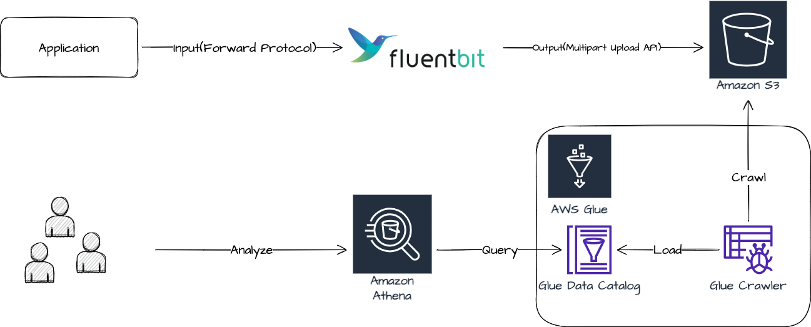

# s3athena
This example is a more specific example for production. In this scenario, we assume that we want to permanently store access logs of our application since access logs should be searchable when needed. We may want to be able to query for certain conditions against our access logs.

## Architecture overview



A brief description of the resources illustrated abobe diagram.
- [Fluent Bit](https://fluentbit.io/); A log forwarder.
- [Amazon S3](https://aws.amazon.com/s3/); A cloud object storage.
- [AWS Glue](https://aws.amazEon.com/glue); A serverless [ETL](https://en.wikipedia.org/wiki/Extract,_transform,_load) service.
- [Amazon Athena](https://aws.amazon.com/athena); A serverless query service that makes it easy to analyze data directly in S3 using standard SQL.

## Prerequisites
- Golang 1.17+
- Environments to run docker compose(like Docker Desktop)
- Amazon S3 bucket for your log files
- AWS identity that has the following permissions
  - `s3:PutObject`
  - `glue:CreateDatabase`
  - `glue:StartCrawler`
  - `glue:CreateCrawler`
- AWS IAM Role that must provide permissions similar to the AWS managed policy, AWSGlueServiceRole, plus access to your data stores.

## Step by step tutorial

1. You have to set ENV `AWS_ACCESS_KEY_ID`, `AWS_SECRET_ACCESS_KEY`.
2. In [fluent-bit.conf](fluent-bit.conf), Replace `${YOUR_S3_BUCKET_NAME_FOR_LOG_FILES}`, `${YOUR_SERVICE_NAME}` with your owns.
3. Run `docker compose up`.
4. In another terminal, run `go run main.go`
5. In another terminal, `curl localhost:3000/ping`

If it worked successfully, you will see the following logs from the fluent-bit container. Depending on the value you set, the log may be slightly different.

```
fluent-bit_1  | [2021/12/07 15:40:18] [ info] [output:s3:s3.0] Successfully uploaded object /example/alpha/year=2021/month=12/day=07/hour=15/minute=40/thS0Tjuj
```

6. If you can see the log as above, then check your S3 bucket if the logs are stored properly.

7. (If it already exists, please skip) Creates a new AWS Glue database.
```shell
aws glue create-database --region ap-northeast-2 --database-input "{\"Name\":\"access_log\"}"
```

8. Create a new AWS Glue crawler(The role is noted in [Prerequisites](#Prerequisites)).
```shell
aws glue create-crawler \
--region ap-northeast-2 \
--name example \
--role service-role/AWSGlueServiceRole-example \
--database-name example \
--targets "{\"S3Targets\":[{\"Path\":\"s3://YOUR_S3_BUCKET_NAME_FOR_LOG_FILES/example/alpha\"}]}" \
--recrawl-policy "{\"RecrawlBehavior\":\"CRAWL_NEW_FOLDERS_ONLY\"}" \
--schema-change-policy "{\"UpdateBehavior\":\"LOG\",\"DeleteBehavior\": \"LOG\"}"  
```

9. Start the crawler.
```shell
aws glue start-crawler --region ap-northeast-2 --name example
```

If the crawling has been completed successfully, you can check the created data catalog table in the AWS Glue console. You can now query the table through Amazon Athena.

## References
To optimize logging settings for your own services, please refer to the following materials.
- [Build a Data Lake Foundation with AWS Glue and Amazon S3](https://aws.amazon.com/ko/blogs/big-data/build-a-data-lake-foundation-with-aws-glue-and-amazon-s3/)
- [Top 10 Performance Tuning Tips for Amazon Athena](https://aws.amazon.com/ko/blogs/big-data/top-10-performance-tuning-tips-for-amazon-athena/)
- [Forward - Fluent Bit: Official Manual](https://docs.fluentbit.io/manual/pipeline/inputs/forward)
- [Amazon S3 - Fluent Bit: Official Manual](https://docs.fluentbit.io/manual/pipeline/outputs/s3)
- [github.com/fluent/fluent-logger-golang](https://github.com/fluent/fluent-logger-golang)
- [github.com/rs/zerolog](https://github.com/rs/zerolog)
